<p align="center">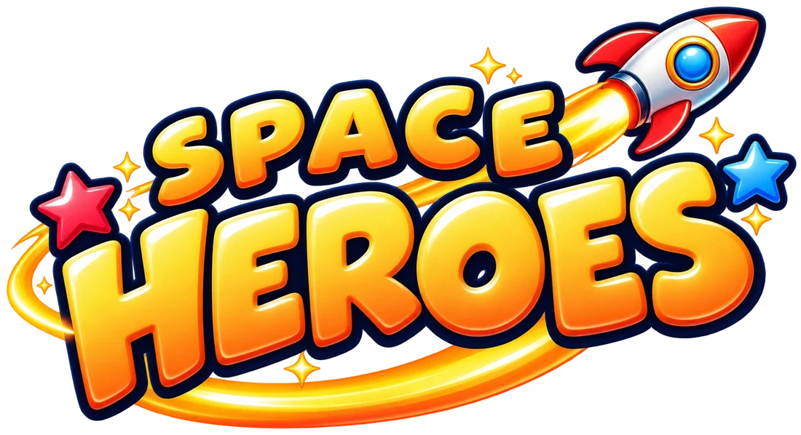 </p>

# Space Heroes · أبطال الفضاء

A 2D team shooter for family game nights on the big screen, inspired by the classic **Soldat**. Jetpacks, Capture the Flag, rockets, freeze rays and bee swarms. Scan the QR code and your **phone becomes a twin-stick gamepad**. There's nothing to install on the phones.

Two ways to watch, and you can mix them in the same match:

- **📺 TV:** everyone watches one big screen. The camera zooms in and out so all players always fit.
- **📱 Phones:** each phone shows the game itself, following its own soldier, with the sticks on top. The laptop only hosts. Great for bigger groups or players in another room.

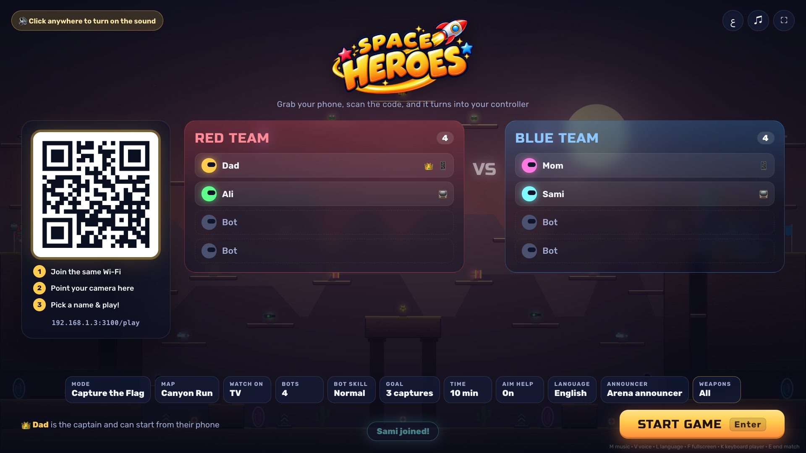

| On the TV | On a phone |
| --- | --- |
| 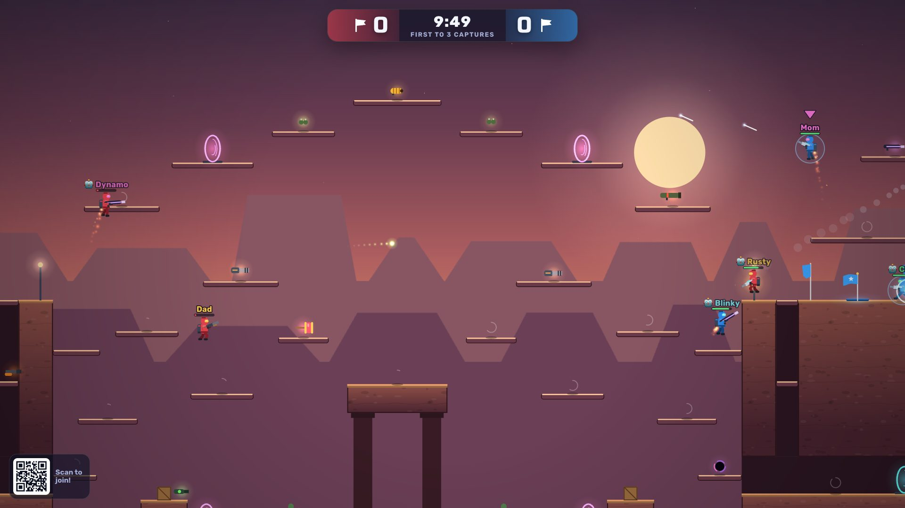 | 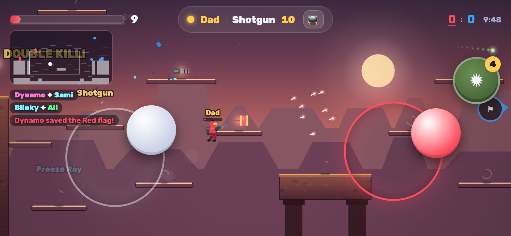 |
| 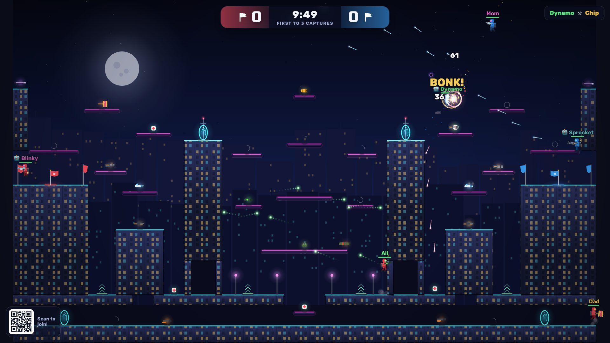 | 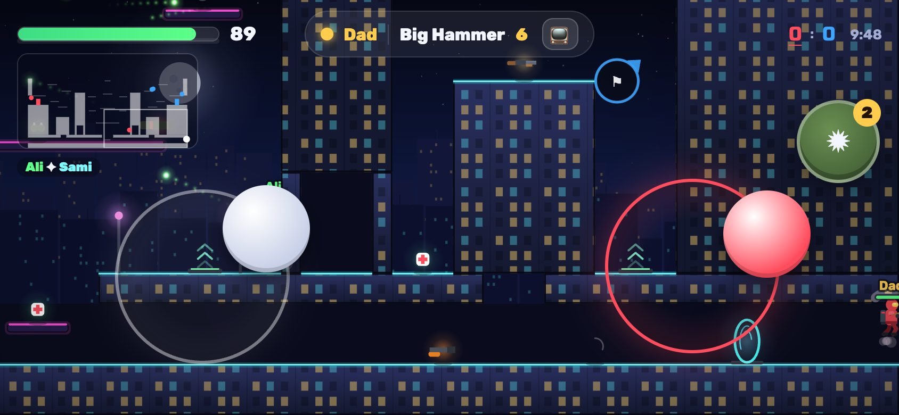 |
| 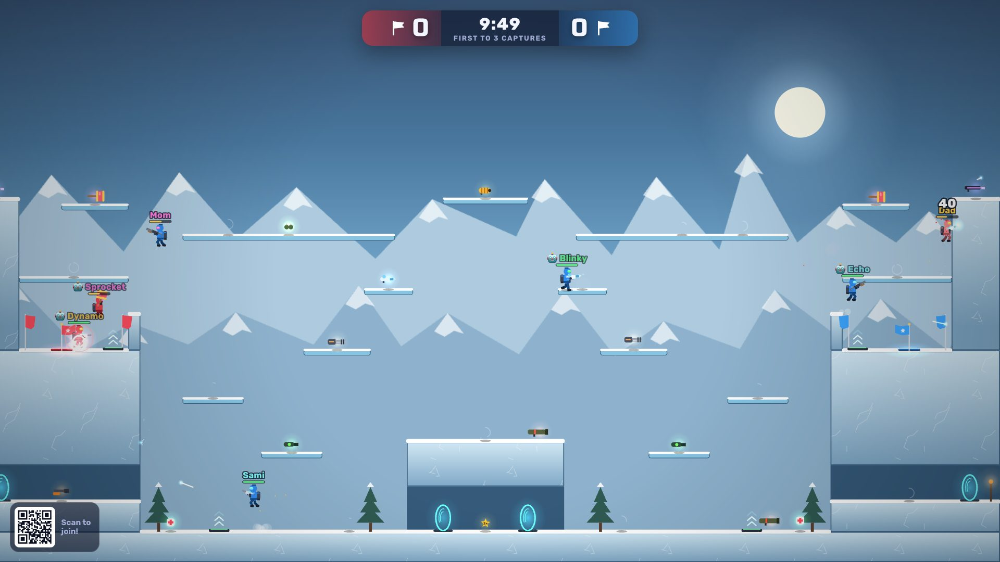 | 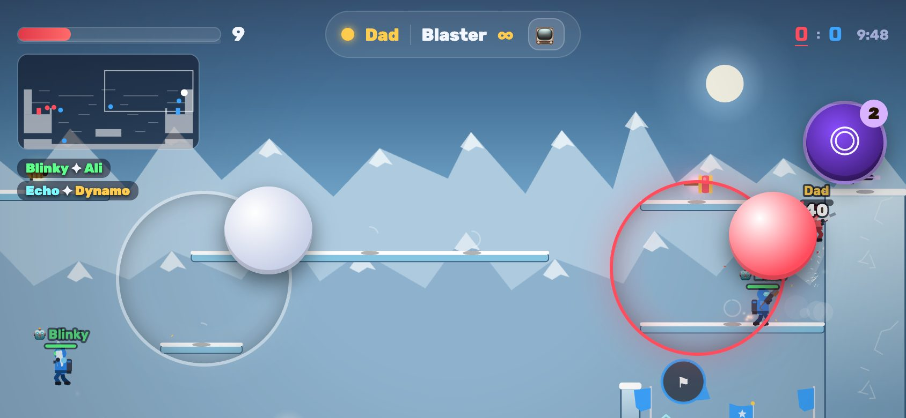 |
| 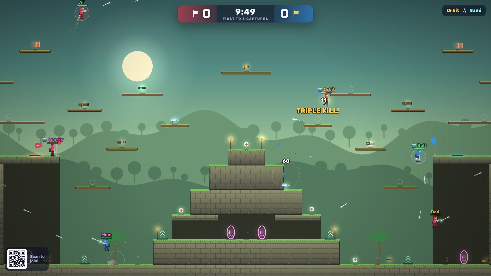 | 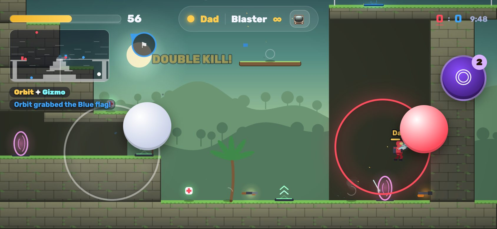 |
| 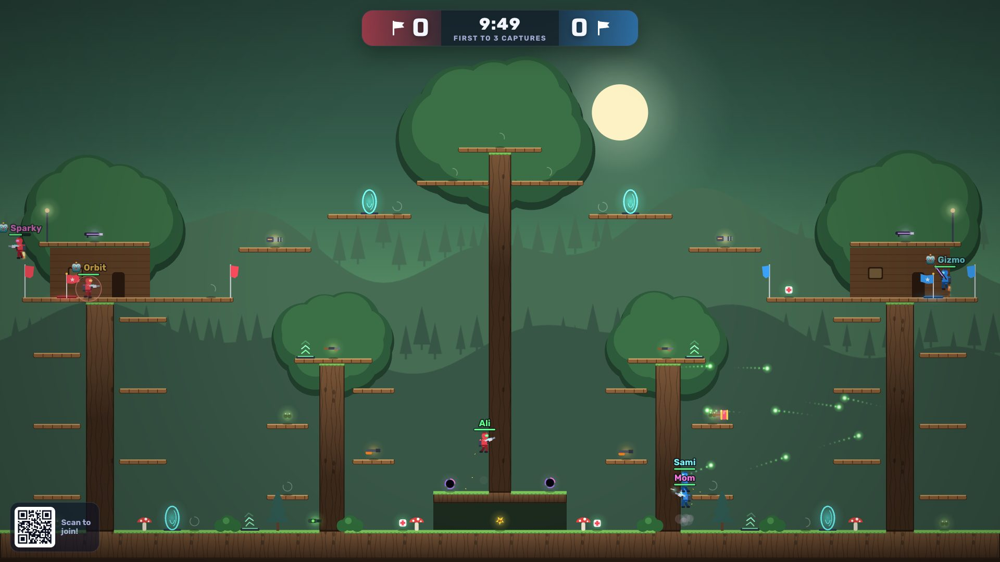 | 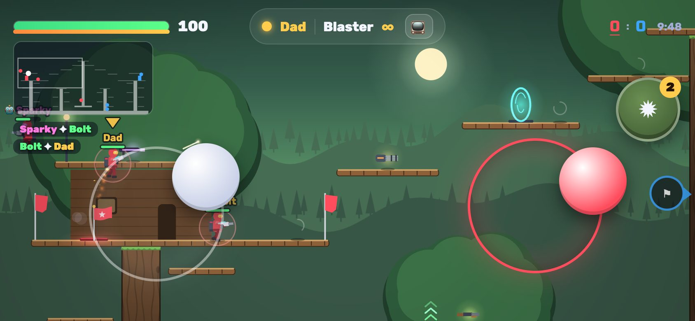 |

## Quick start

You need [Node.js](https://nodejs.org) 20 or newer (the project pins 24 in `.nvmrc`).

```bash
git clone https://github.com/AkramYamin/kanab.git
cd kanab
npm install
npm start
```

1. Open **http://localhost:3000** on the laptop. Connect the laptop to the TV and press **F** for fullscreen.
2. Click once anywhere on the TV page to turn the sound on (browsers require this).
3. Everyone joins the **same Wi-Fi** as the laptop and scans the QR code on the TV.
4. The first player to join is the **captain** 👑 and can change settings and start the match from their phone. You can also click the settings on the TV and press **Enter**.
5. **Watch on** (lobby setting) picks TV or Phones for everyone. Each player can still switch on their own phone: in the lobby, or with the 📱/📺 button during a match.

> On macOS the first time a phone connects you may see *"Allow node to accept incoming connections?"*. Click **Allow**.

## Languages · اللغات

The game speaks **English** and **Arabic (العربية)**: the TV, the phones and the announcer.

- Change it with the **Language** setting in the lobby (or press `L` on the laptop). Every screen follows it, and Arabic switches the menus to right-to-left.
- A phone can pick its own language on the join screen, so a guest can use English while the TV is in Arabic.
- The announcer is a recorded **Arena announcer** voice in both languages, made with AI (see [Announcer voices](#announcer-voices-ai)). The lobby's **Announcer** setting switches between voice packs and *Computer voice*, which uses the computer's built-in speech (on a Mac the Arabic voice is **Majed**; to add one: System Settings → Accessibility → Spoken Content → System voice → Manage Voices; on Windows: Settings → Time & language → Speech → Add voices).

| العربية على التلفاز | على الهاتف |
| --- | --- |
| 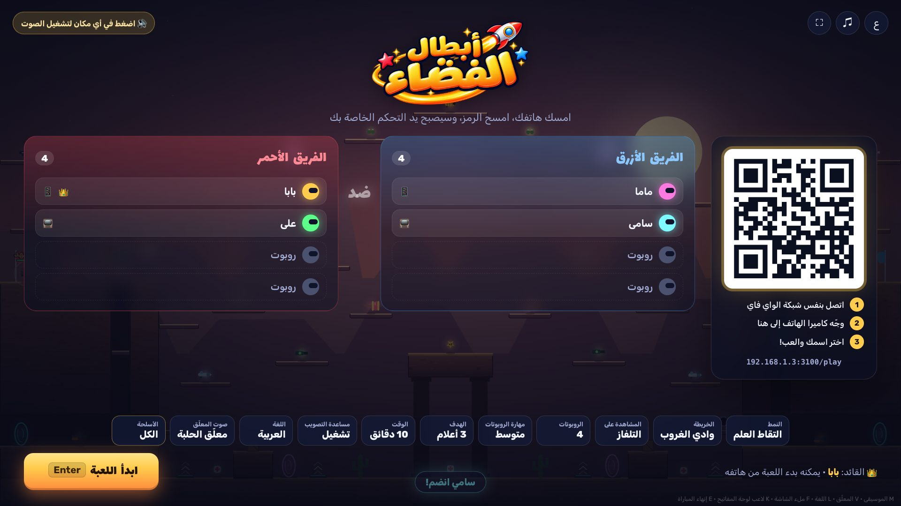 | 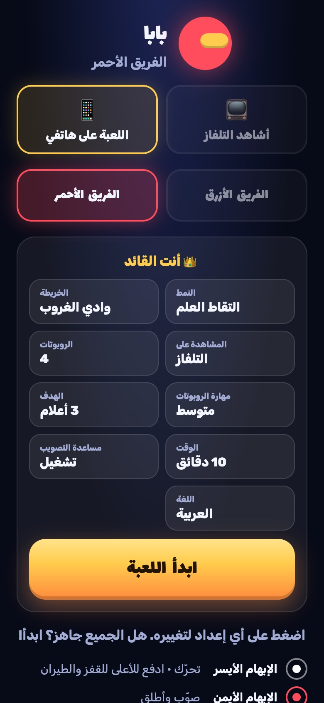 |

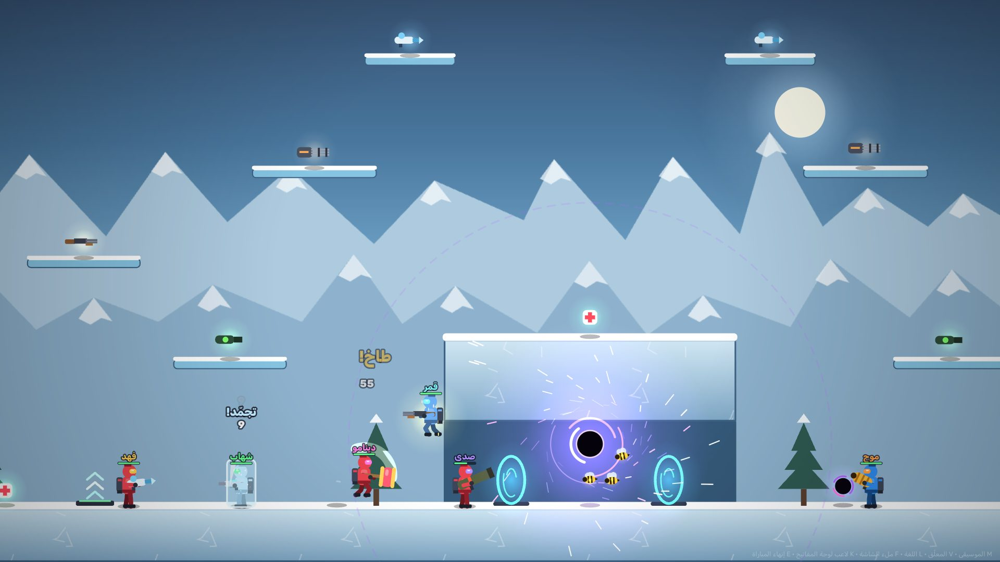

## Family touches: team names and a picture (they stay on your computer)

Name the two teams after your kids and put a picture of them in the game. Everything goes in the folder `public/family/`, which is in `.gitignore`, so names, photos and voices never go to GitHub. Delete the folder to go back to Red and Blue.

**1. Team names.** Copy the example and edit it:

```bash
mkdir -p public/family
cp docs/family.example.json public/family/family.json
```

```json
{
  "teams": {
    "red": { "en": "Sara", "ar": "سارة" },
    "blue": { "en": "Omar", "ar": "عمر" }
  },
  "background": "background.jpg"
}
```

`red` is the team on the left, `blue` the one on the right. Give each name in English (`en`) and Arabic (`ar`). The game then says *Team Sara* / «فريق سارة» everywhere: the lobby, the scoreboard, the banners, the results and the phones.

**2. The picture.** Save a wide 16:9 picture (for example 1920×1080) as `public/family/background.jpg`, with the red team's kid on the **left** and the blue team's on the **right**, faces in the upper half. It fills the lobby (the team lists move to the middle and the QR code to a corner so both faces stay visible) and shows with "Team Sara VS Team Omar" while each match counts down. To use another file name or a `.png` / `.webp`, change `"background"` in `family.json`.

To make the picture, an AI image tool (for example GPT Image in ChatGPT) works well. Upload a photo of each kid, the red team's kid first, and use a prompt like: *"Wide 16:9 video game splash art. Use the two photos only as likeness references: image 1 on the left in glossy red sci-fi commando armor with a jetpack and a big toy hammer, image 2 on the right in blue armor with a freeze-ray blaster, facing each other with playful grins. Friendly 3D cartoon style. Red sparks behind the left kid, blue frost behind the right one, colliding in a golden burst in the middle. Keep the center and the bottom fifth calm for the game's text. No text, logos or watermarks."*

**3. Refresh** the TV page (and reload the phones). The server reads `family.json` and the picture every time, so there's no need to restart it.

**4. Optional: the announcer says the names.** With the [voice tool](#announcer-voices-ai) set up, `npm run voices -- --teams` records the 10 team lines in each language («فريق سارة يسجّل!», "Team Sara scores!"), about 15 minutes. Run it again after changing the names. Until then the computer's voice says those lines, so the announcer never calls the teams "Red" and "Blue" by mistake.

## Controls

**Phone (hold it sideways):**

| Thumb | What it does |
| --- | --- |
| Left side | Move. Push **up** to jump, keep holding to fly with the jetpack. Push **down** to drop through thin platforms. |
| Right side | Aim. Shooting starts as soon as you drag. Let go to stop. |
| Grenade button | Throw a grenade where you're aiming. |

When the game is on your phone you also get a minimap and edge arrows pointing to the flag (⚑) or, while you carry it, back home (⌂).

Each stick appears wherever your thumb lands and follows it if you slide too far, so small hands never have to find a button. Aim help (on by default) gently bends shots toward nearby enemies.

**Laptop keyboard (TV page):** `Enter` start / play again · `Esc` back to lobby · `E` end the match now · `L` language · `F` fullscreen · `M` music · `V` announcer voice · `K` add a keyboard + mouse player (WASD, mouse to aim/shoot, `G` grenade).

## Game modes and content

- **Capture the Flag**: grab the enemy flag and bring it to your base while your own flag is home.
- **Team Deathmatch** and **Free for All**.
- **5 big maps**: Canyon Run, Neon District, Glacier Keep, Jungle Temple and Treehouse Forest. Each has tunnels, towers and several routes between the bases, plus:
  - **Jump pads** (green arrows) that fling you up to the high routes.
  - **Teleporters** (glowing portals, in pairs of the same color). Walk in and you come out of its twin. Step out and back in to return.
- **10 weapons** plus grenades: Blaster, Shotgun, Minigun, Railgun, Rockets, Flamer, Bouncer, Freeze Ray, Bee Swarm and Big Hammer. Pickups for health, grenades, black holes and a double damage star.
  - *Rockets* speed up as they fly and explode on the first wall or player they hit. The blast hurts enemies nearby and throws everyone around. Shoot at your feet to rocket-jump; your own rockets never hurt you.
  - *Freeze Ray* sprays ice. Keep it on someone for about a second and they freeze in an ice block for 1.6 s: they can't move, jump or shoot, and they slide around. Right after thawing nobody can freeze them again for a moment.
  - *Bee Swarm* shoots 3 bees that fly to the nearest enemy they can see, so aiming hardly matters. Great for the youngest players. It's the strongest weapon, so every map has just one, at the very top in the middle, and it takes 25 s to come back.
  - *Big Hammer* is a toy hammer: every swing leaps you forward and launches whoever it hits across the map (BONK!). It shatters frozen enemies for extra damage.
  - *Black holes* (purple swirl pickup) replace your next 2 grenades. Thrown like a grenade, it floats up and pulls enemies in for 2 seconds, then pops. Teammates are safe.
- **Choose the weapons**: the lobby's **Weapons** button opens a panel where you tap weapons on or off (the blaster always stays). Spots of a switched-off weapon get another weapon, the same on both sides, so you can play a hammers-only match, or one without rockets.
- **Bots** (easy / normal / hard) fill the teams when you're short on players.
- An announcer voice, live-generated sound effects in stereo, music, and phone vibration (Android) when you get hit or frozen.


| Weapons on the TV | …and on the captain's phone |
| --- | --- |
| 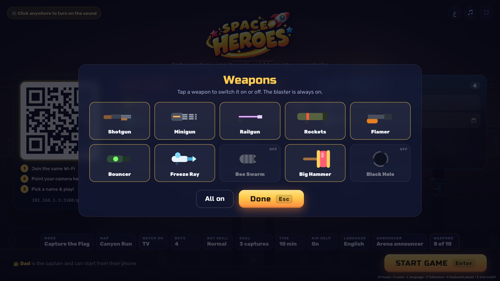 | 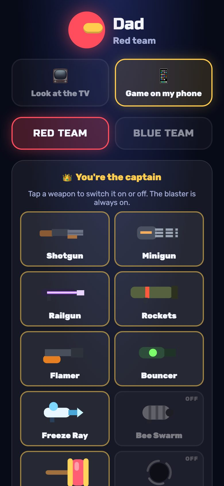 |

## How it works

```
 phones ──stick input, ~60/s──► Node server on the laptop ──snapshots 60/s──► TV / laptop screen
   ▲                            runs the match at 60 steps/s
   └──── HUD + vibration (all phones) · snapshots 30/s (phones showing the game)
```

- The match runs on the laptop's Node server, so it keeps going even if the TV tab is closed. The same game code (`public/js/game.js`) runs in Node and in the browser.
- **No-lag phones:** a phone that shows the game moves its own soldier with the same physics locally, so it reacts instantly. The server's snapshots correct it smoothly (usually by just a few pixels). Everyone else is smoothed between snapshots.
- There's no build step: plain ES modules and Canvas 2D. Distant scenery is painted once, and the level is drawn as crisp vector shapes, so it stays sharp at any camera zoom.
- Sound effects are made on the fly with the Web Audio API, so there are no sound files. Only the announcer is recorded (below).

## Announcer voices (AI)

The announcer lines are short MP3 clips in `public/voices/announcer/` (Arabic and English), made on this laptop with two open AI models: [Chatterbox](https://github.com/resemble-ai/chatterbox) (Resemble AI, MIT) speaks each line in the voice of a short recording, and [Whisper](https://huggingface.co/openai/whisper-large-v3-turbo) (OpenAI, MIT) listens to 3 takes of every line and keeps the one it understands best. The music ducks while the announcer talks.

You can make your own pack from a 10-second recording, for example a parent's voice:

```bash
npm run voices:setup                     # once: private Python + packages in tools/voice/
npm run voices -- --pack baba --name "Baba" --ref ~/Desktop/baba.m4a --lang ar
```

Then pick it with the lobby's **Announcer** setting. Your own packs stay out of git. Details are in [tools/voice/README.md](tools/voice/README.md). None of this is needed to play.

Dependencies (all long-lived, widely used projects):

| Package | Why |
| --- | --- |
| [`ws`](https://github.com/websockets/ws) | WebSocket server (since 2011) |
| [`qrcode`](https://github.com/soldair/node-qrcode) | QR code for the join link (since 2010) |
| [`nipplejs`](https://github.com/yoannmoinet/nipplejs) 0.10.x | Touch joysticks (since 2015; pinned to the stable 0.10 line) |

Everything installs into the project's own `node_modules` and nothing is installed globally. The optional voice maker keeps its Python packages inside `tools/voice/` too. `.nvmrc` pins the Node version and `.npmrc` enforces exact versions.

## Project layout

```
server.js            static files + WebSockets + QR code
server/host.js       lobby, settings, match flow, runs the simulation
public/index.html    TV / laptop screen
public/play.html     phone (controller + optional game view)
public/js/
  game.js            simulation: physics, jetpacks, pads, teleporters, weapons, flags
  bots.js            bot AI (grid A* path-finding that knows pads/portals, aiming)
  maps.js            map layouts and themes
  protocol.js        compact snapshot format
  world.js           client copy of the match, smoothed between snapshots
  camera.js          TV auto-zoom camera and phone follow camera
  render.js          canvas renderer and effects
  events.js          turns match events into effects and sounds
  audio.js           synthesized sound effects, music, announcer
  i18n.js            English and Arabic text
  tv.js              TV page
public/voices/       announcer voice packs (MP3 clips + manifest.json)
tools/voice/         AI voice maker (Chatterbox + Whisper, private Python env)
scripts/check-maps.mjs    validates every map and runs bot-only matches
scripts/test-weapons.mjs  checks freeze, bees, hammer and black holes do what they should
scripts/voices.mjs        makes announcer clips from the lines in i18n.js
scripts/screenshots.mjs   regenerates the README screenshots with headless Chrome
```

## Tips

- If phones can't connect, check they're on the same Wi-Fi (not a guest network) and that the address under the QR code starts with your laptop's local IP. You can force it with `HOST_IP=192.168.1.20 npm start`, or change the port with `PORT=8080`.
- iPhone: for a true fullscreen controller, tap Share → *Add to Home Screen* and open it from there.
- Regenerate screenshots: `FAMILY_DIR=none npm start` in one terminal (so your family names and picture stay out), `npm run screenshots` in another (uses your installed Google Chrome).
- Made a map? `npm run check-maps` checks that everything is reachable and that bots can capture flags on it.
- Changed a weapon? `npm run test-weapons` runs quick checks of the special weapons.

## License

MIT. Have fun, and share it with other kids!
