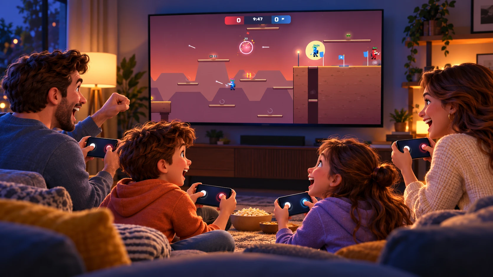
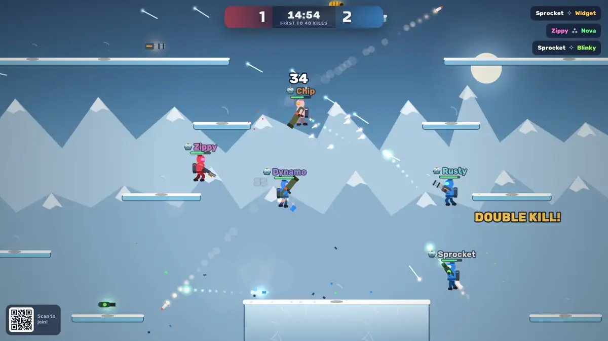
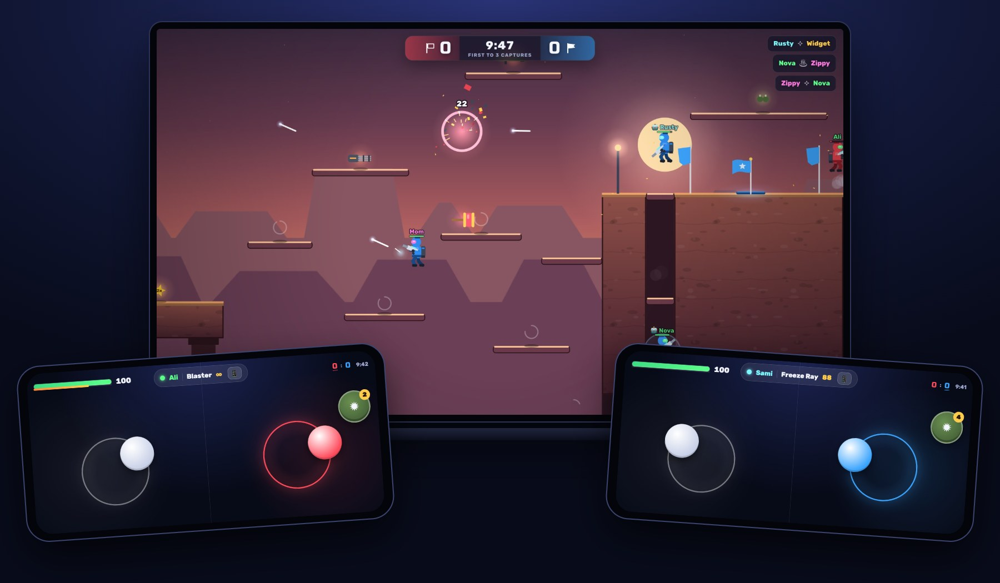
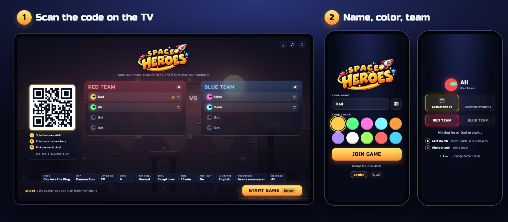
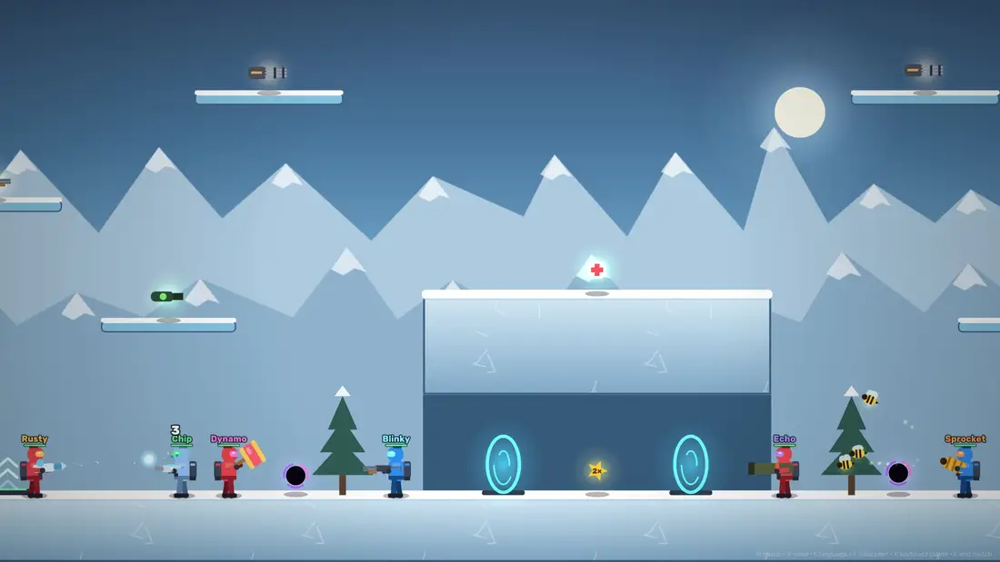
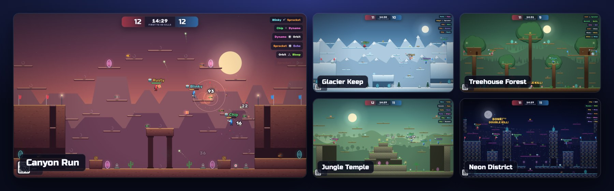
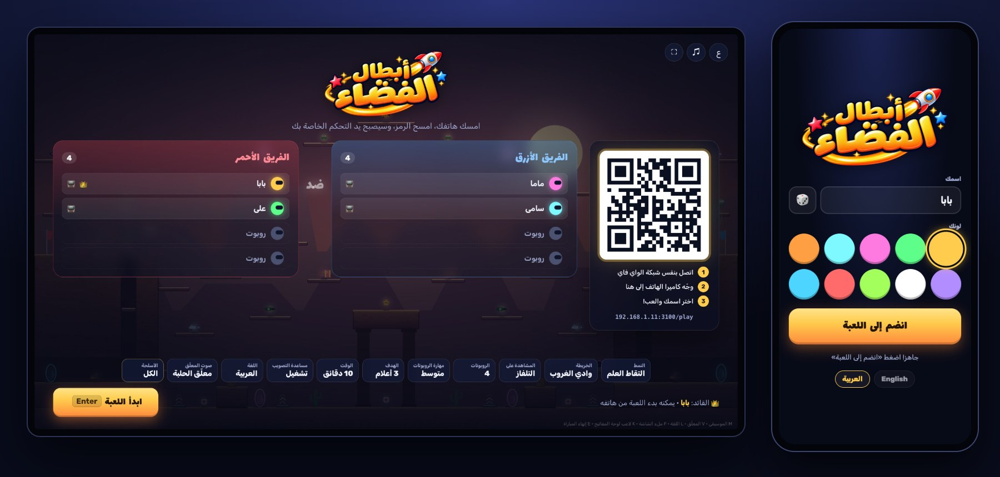

<p align="center">
  
</p>

<p align="center">
  <b>A jetpack team shooter for family game night.</b><br>
  The game is on the TV, and every phone in the room is a controller. Scan, tap, play.
</p>

<p align="center">
  
</p>

## Why it's fun

- **No app, no gamepads.** Point a phone's camera at the TV and it turns into a twin-stick controller. Anyone in the room can join in seconds.
- **Kids and grown-ups play together.** Aim help bends shots toward enemies, Bee Swarm bullets find their own target, and easy bots fill the empty spots.
- **Silly weapons.** Freeze your dad in an ice block, send your brother flying with a toy hammer, or throw a black hole that sucks everyone in.
- **Built for jetpacks.** Five big maps full of towers, tunnels, jump pads and portals.
- **Capture the Flag, Team Deathmatch or Free for All**, with up to 8 bots.
- **English and Arabic (العربية)** on every screen, with a cheering announcer in both.



## Your phone is the controller



Hold the phone sideways. The **left thumb** moves: push up to jump, keep holding to fly. The **right thumb** aims, and you shoot as soon as you drag. The round button throws a grenade. Each stick appears wherever your thumb lands, so small hands never have to find a button.

## Join in seconds



Everyone on the same Wi-Fi scans the code, picks a name, a color and a team, and appears on the TV. The first player to join is the **captain** 👑 and can change the settings and start the match from their phone.

## Weapons



| Weapon | What it does |
| --- | --- |
| **Blaster** | Your trusty starter. It never runs out. |
| **Shotgun** · **Minigun** · **Railgun** | Close-range spray, a stream of bullets, and one long beam across the map. |
| **Rockets** | A big boom that throws everyone around. Shoot your feet to rocket-jump; your own rockets never hurt you. |
| **Flamer** · **Bouncer** | Short-range fire, and balls that bounce around corners. |
| **Freeze Ray** | Hold it on someone for a second and they freeze solid in an ice block. |
| **Bee Swarm** | Three bees fly to the nearest enemy, so aiming hardly matters. The strongest weapon: one per map, at the very top. |
| **Big Hammer** | Every swing leaps you forward, and whoever it hits flies across the map. BONK! |
| **Black hole** | A grenade pickup: it floats, pulls enemies in for two seconds, then pops. |

Grab health, grenades and the double-damage star along the way. In the lobby, **Weapons** lets you switch any of them off, for example for a hammers-only match.

## Five maps



Every map has several routes between the two bases, **jump pads** (green arrows) that fling you to the high paths, and **portals** in matching pairs.

## العربية



<p dir="rtl">اللعبة كاملة بالعربية: القوائم على التلفاز والهواتف، والمعلّق الصوتي.</p>

Switch with **Language** in the lobby (or press `L`). A phone can pick its own language on the join screen, so a guest can play in English while the TV is in Arabic.

## Get started

You need [Node.js](https://nodejs.org) 20 or newer on a laptop.

```bash
git clone https://github.com/AkramYamin/space-heroes.git
cd space-heroes
npm install
npm start
```

1. Open **http://localhost:3000** on the laptop, connect the laptop to the TV and press **F** for fullscreen. Click once to turn the sound on.
2. Phones join the **same Wi-Fi** and scan the code on the TV.
3. Press **Start game** on the TV (or the captain does it on their phone).

On macOS, click **Allow** if it asks whether *node* may accept incoming connections.

<details>
<summary><b>Lobby settings and laptop keys</b></summary>

- **Mode**, **Map**, **Goal** and **Time** for the match.
- **Watch on**: everyone watches the TV, or each phone also shows the game itself.
- **Bots** (0 to 8) and **Bot skill** (easy, normal, hard). Easy bots go easy on young players: they hit softer, react slower and never pick up weapons.
- **Aim help** (on by default) gently bends shots toward nearby enemies.
- **Language**, **Announcer** and **Weapons**.

Laptop keys on the TV page: `Enter` start / play again · `Esc` back to the lobby · `E` end the match · `L` language · `F` fullscreen · `M` music · `V` announcer · `K` add a keyboard-and-mouse player (WASD, mouse to aim and shoot, `G` grenade).

</details>

<details>
<summary><b>Make it yours: team names and a family picture</b></summary>

Name the two teams after your kids and put their picture in the lobby. Everything lives in `public/family/`, which git ignores, so names and photos never leave your computer. Delete the folder to go back to Red and Blue.

```bash
mkdir -p public/family
cp docs/family.example.json public/family/family.json
```

```json
{
  "teams": {
    "red": { "en": "Sara", "ar": "سارة" },
    "blue": { "en": "Omar", "ar": "عمر" }
  },
  "background": "background.jpg"
}
```

`red` is the team on the left, `blue` on the right. The game then says *Team Sara* / «فريق سارة» everywhere: the lobby, the scoreboard, the banners and the phones.

For the picture, save a wide 16:9 image as `public/family/background.jpg`, with the red team's kid on the **left** and the blue team's on the **right**, faces in the upper half. It fills the lobby and shows with "Team Sara VS Team Omar" before each match. An AI image tool works well: upload a photo of each kid and ask for *"wide 16:9 video game splash art, the first kid on the left in red sci-fi armor with a jetpack, the second on the right in blue armor, facing each other with playful grins, friendly 3D cartoon style, no text"*.

Refresh the TV page and the phones to see it; there's no need to restart the server. With the [voice tool](#announcer-voices) set up, `npm run voices -- --teams` also makes the announcer say the names («فريق سارة يسجّل!»).

</details>

<details id="announcer-voices">
<summary><b>Announcer voices</b></summary>

The announcer clips in `public/voices/announcer/` (English and Arabic) were made on a laptop with two open AI models: [Chatterbox](https://github.com/resemble-ai/chatterbox) speaks each line in the voice of a short recording, and [Whisper](https://huggingface.co/openai/whisper-large-v3-turbo) listens to several takes and keeps the clearest one. The lobby's **Announcer** setting switches between voice packs and the computer's own speech (on a Mac the Arabic voice is *Majed*).

To make your own pack from a 10-second recording, for example a parent's voice:

```bash
npm run voices:setup     # once: a private Python environment in tools/voice/
npm run voices -- --pack baba --name "Baba" --ref ~/Desktop/baba.m4a --lang ar
```

Your own packs stay out of git. See [tools/voice/README.md](tools/voice/README.md). None of this is needed to play.

</details>

<details>
<summary><b>Trouble connecting?</b></summary>

- Phones must be on the same Wi-Fi as the laptop, not a guest network. The address under the QR code should start with the laptop's local IP; force it with `HOST_IP=192.168.1.20 npm start`, or change the port with `PORT=8080`.
- On iPhone, tap Share → *Add to Home Screen* for a true fullscreen controller.

</details>

<details>
<summary><b>How it works (for developers)</b></summary>

```
 phones ──stick input──► Node server on the laptop ──snapshots 60/s──► TV
   ▲                     runs the match at 60 steps/s
   └──── HUD and vibration · snapshots 30/s for phones showing the game
```

- The laptop's Node server runs the match, so it keeps going even if the TV tab is closed. The same game code (`public/js/game.js`) runs in Node and in the browser.
- A phone that shows the game moves its own soldier locally with the same physics, so it reacts instantly; the server's snapshots correct it smoothly.
- No build step: plain ES modules and Canvas 2D. Sound effects are synthesized with the Web Audio API.
- Three small, long-lived dependencies: [`ws`](https://github.com/websockets/ws) (WebSockets), [`qrcode`](https://github.com/soldair/node-qrcode) and [`nipplejs`](https://github.com/yoannmoinet/nipplejs) (touch sticks). `.nvmrc` pins Node and `.npmrc` enforces exact versions.

| Path | What's inside |
| --- | --- |
| `server.js`, `server/host.js` | Web server, QR code, lobby and match flow |
| `public/index.html`, `public/play.html` | The TV page and the phone page |
| `public/js/game.js` | Simulation: physics, jetpacks, weapons, flags |
| `public/js/bots.js` | Bot AI with path-finding that knows pads and portals |
| `public/js/maps.js` | Map layouts and themes |
| `public/js/render.js`, `audio.js`, `i18n.js` | Drawing, sound and music, English and Arabic text |
| `scripts/` | `check-maps`, `test-weapons`, `voices` and `media` (makes the README pictures) |

`npm run check-maps` checks that every map is reachable and that bots can capture flags on it. `npm run test-weapons` checks the special weapons.

</details>

## License

MIT. Have fun, and share it with other families!
