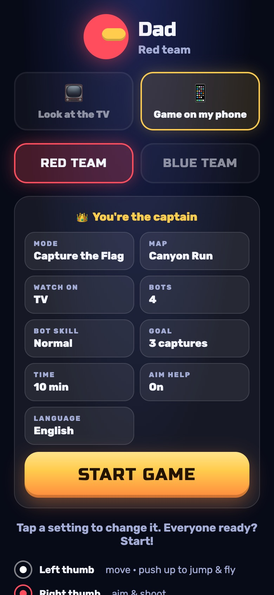

# Couch Commandos · كوماندوز الكنبة

*kanab* (كنبة) is Arabic for couch: this game was made for family game nights on the sofa.


A 2D team shooter for the big screen, inspired by the classic **Soldat**. Jetpacks, Capture the Flag, rockets and railguns. Scan the QR code and your **phone becomes a twin-stick gamepad**. There's nothing to install on the phones.

Two ways to watch, and you can mix them in the same match:

- **📺 TV:** everyone watches one big screen. The camera zooms in and out so all players always fit.
- **📱 Phones:** each phone shows the game itself, following its own soldier, with the sticks on top. The laptop only hosts. Great for bigger groups or players in another room.


| On the TV | On a phone |
| --- | --- |
|  |  |
|  |  |
|  |  |
|  |  |

## Quick start

You need [Node.js](https://nodejs.org) 20 or newer (the project pins 24 in `.nvmrc`).

```bash
git clone https://github.com/AkramYamin/kanab.git
cd kanab
npm install
npm start
```

1. Open **http://localhost:3000** on the laptop. Connect the laptop to the TV and press **F** for fullscreen.
2. Click once anywhere on the TV page to turn the sound on (browsers require this).
3. Everyone joins the **same Wi-Fi** as the laptop and scans the QR code on the TV.
4. The first player to join is the **captain** 👑 and can change settings and start the match from their phone. You can also click the settings on the TV and press **Enter**.
5. **Watch on** (lobby setting) picks TV or Phones for everyone. Each player can still switch on their own phone: in the lobby, or with the 📱/📺 button during a match.

> On macOS the first time a phone connects you may see *"Allow node to accept incoming connections?"*. Click **Allow**.

## Languages · اللغات

The game speaks **English** and **Arabic (العربية)**: the TV, the phones and the announcer.

- Change it with the **Language** setting in the lobby (or press `L` on the laptop). Every screen follows it, and Arabic switches the menus to right-to-left.
- A phone can pick its own language on the join screen, so a guest can use English while the TV is in Arabic.
- The announcer uses the computer's built-in voices. On a Mac the Arabic voice is **Majed**. If Arabic is chosen and no Arabic voice is installed, the TV shows how to add one (System Settings → Accessibility → Spoken Content → System voice → Manage Voices; on Windows: Settings → Time & language → Speech → Add voices).

| العربية على التلفاز | على الهاتف |
| --- | --- |
|  |  |

## Controls

**Phone (hold it sideways):**

| Thumb | What it does |
| --- | --- |
| Left side | Move. Push **up** to jump, keep holding to fly with the jetpack. Push **down** to drop through thin platforms. |
| Right side | Aim. Shooting starts as soon as you drag. Let go to stop. |
| Grenade button | Throw a grenade where you're aiming. |

When the game is on your phone you also get a minimap and edge arrows pointing to the flag (⚑) or, while you carry it, back home (⌂).

Each stick appears wherever your thumb lands and follows it if you slide too far, so small hands never have to find a button. Aim help (on by default) gently bends shots toward nearby enemies.

**Laptop keyboard (TV page):** `Enter` start / play again · `Esc` back to lobby · `E` end the match now · `L` language · `F` fullscreen · `M` music · `V` announcer voice · `K` add a keyboard + mouse player (WASD, mouse to aim/shoot, `G` grenade).

## Game modes and content

- **Capture the Flag**: grab the enemy flag and bring it to your base while your own flag is home.
- **Team Deathmatch** and **Free for All**.
- **4 big maps**: Canyon Run, Neon District, Glacier Keep, Jungle Temple. Each has tunnels, towers and several routes between the bases, plus:
  - **Jump pads** (green arrows) that fling you up to the high routes.
  - **Teleporters** (glowing portals, in pairs of the same color). Walk in and you come out of its twin. Step out and back in to return.
- **7 weapons** plus grenades: Blaster, Shotgun, Minigun, Railgun, Rockets, Flamer, Bouncer. Pickups for health, grenades and a double damage star.
  - *Rockets* speed up as they fly and explode on the first wall or player they hit. The blast hurts enemies nearby and throws everyone around. Shoot at your feet to rocket-jump; your own rockets never hurt you.
- **Bots** (easy / normal / hard) fill the teams when you're short on players.
- An announcer voice, live-generated sound effects in stereo, music, and phone vibration (Android) when you get hit.

## How it works

```
 phones ──stick input, ~60/s──► Node server on the laptop ──snapshots 60/s──► TV / laptop screen
   ▲                            runs the match at 60 steps/s
   └──── HUD + vibration (all phones) · snapshots 30/s (phones showing the game)
```

- The match runs on the laptop's Node server, so it keeps going even if the TV tab is closed. The same game code (`public/js/game.js`) runs in Node and in the browser.
- **No-lag phones:** a phone that shows the game moves its own soldier with the same physics locally, so it reacts instantly. The server's snapshots correct it smoothly (usually by just a few pixels). Everyone else is smoothed between snapshots.
- There's no build step: plain ES modules and Canvas 2D. Distant scenery is painted once, and the level is drawn as crisp vector shapes, so it stays sharp at any camera zoom.
- All sound is made on the fly with the Web Audio API. There are no audio files.

Dependencies (all long-lived, widely used projects):

| Package | Why |
| --- | --- |
| [`ws`](https://github.com/websockets/ws) | WebSocket server (since 2011) |
| [`qrcode`](https://github.com/soldair/node-qrcode) | QR code for the join link (since 2010) |
| [`nipplejs`](https://github.com/yoannmoinet/nipplejs) 0.10.x | Touch joysticks (since 2015; pinned to the stable 0.10 line) |

Everything installs into the project's own `node_modules` and nothing is installed globally. `.nvmrc` pins the Node version and `.npmrc` enforces exact versions.

## Project layout

```
server.js            static files + WebSockets + QR code
server/host.js       lobby, settings, match flow, runs the simulation
public/index.html    TV / laptop screen
public/play.html     phone (controller + optional game view)
public/js/
  game.js            simulation: physics, jetpacks, pads, teleporters, weapons, flags
  bots.js            bot AI (grid A* path-finding that knows pads/portals, aiming)
  maps.js            map layouts and themes
  protocol.js        compact snapshot format
  world.js           client copy of the match, smoothed between snapshots
  camera.js          TV auto-zoom camera and phone follow camera
  render.js          canvas renderer and effects
  events.js          turns match events into effects and sounds
  audio.js           synthesized sound effects, music, announcer
  i18n.js            English and Arabic text
  tv.js              TV page
scripts/check-maps.mjs    validates every map and runs bot-only matches
scripts/screenshots.mjs   regenerates the README screenshots with headless Chrome
```

## Tips

- If phones can't connect, check they're on the same Wi-Fi (not a guest network) and that the address under the QR code starts with your laptop's local IP. You can force it with `HOST_IP=192.168.1.20 npm start`, or change the port with `PORT=8080`.
- iPhone: for a true fullscreen controller, tap Share → *Add to Home Screen* and open it from there.
- Regenerate screenshots: `npm start` in one terminal, `npm run screenshots` in another (uses your installed Google Chrome).
- Made a map? `npm run check-maps` checks that everything is reachable and that bots can capture flags on it.

## License

MIT. Have fun, and share it with other kids!
